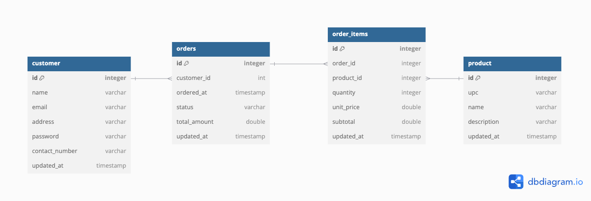
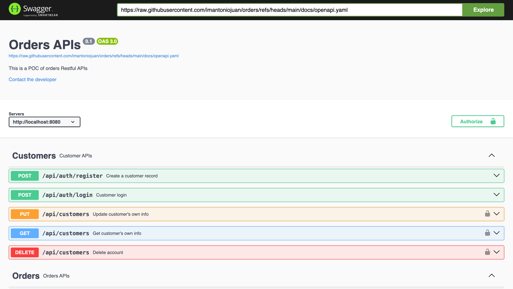

# Orders POC 

## Requirements

For building and running the application you need:

#### Manual Build:
- [JDK 11](https://jdk.java.net/archive/)
- [Maven 3](https://maven.apache.org)
- [MySQL 8.0](https://dev.mysql.com/downloads/mysql/8.0.html)

#### Docker Build:
- [Docker](https://www.docker.com/products/docker-desktop/)

## Running the application locally

#### Manual Build and Run:

There are several ways to run a Spring Boot application on your local machine. One way is to execute the `main` method in the `com.anthony.orders.OrdersApplication` class from your IDE.

Second, you can use the [Spring Boot Maven plugin](https://docs.spring.io/spring-boot/docs/current/reference/html/build-tool-plugins-maven-plugin.html) like so:

```
mvn spring-boot:run
```

Lastly, you can compile the jar file and run it like so:

```
mvn install
java -jar target/orders-0.0.1-SNAPSHOT.jar
```

#### Docker Build and Run:
To run everything in Docker:
```
docker compose up --build
```

## About the Service

The service is just a simple order REST service. It uses an MySQL to store the data. Once database connection works, REST endpoints are on **port 8080**. (see below)

#### Here is what this application demonstrates: 

* Full integration with the latest **Spring** Framework: inversion of control, dependency injection, etc.
* Packaging as a single jar and just run using the ``java -jar`` command
* Writing a RESTful service using annotation: supports JSON request / response;
* *Spring Data* Integration with JPA/Hibernate with configuration and familiar annotations. 
* Automatic CRUD functionality against the data source using Spring *Repository* pattern
* Demonstrates SpringBootTest test framework with associated libraries 
* Packaging and running application and database using docker compose and Dockerfile

#### Here is an overview of the application's APIs:

* All APIs except /api/auth/register and /api/auth/login **require** a JWT Token which are retrieved after logging in using /api/auth/login
* Anyone can register for now
* An order and product records can be created without any dependencies
* An order item record require for an order and a product record to be already created

## Running unit tests

Unit tests can be run like so:

```
mvn test
```

## Future implementations

Some features that could be implemented:

* Make use of a permission table to handle authorization to APIs via path and method (i.e. Customer 1 may have access to create new products but Customer 2 may only create orders and order items.
* Make use of an SMTP service to send a registation OTP upon registration
* Breaking down of the full application into microservices
* Make use of any caching mechanisms for optimizations on scaling

## Database overview


## APIs

[
https://petstore.swagger.io/?url=https://raw.githubusercontent.com/imantoniojuan/orders/refs/heads/main/docs/openapi.yaml]